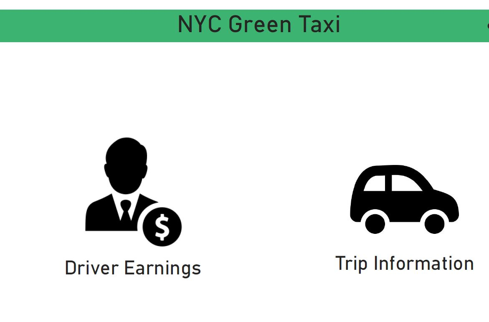
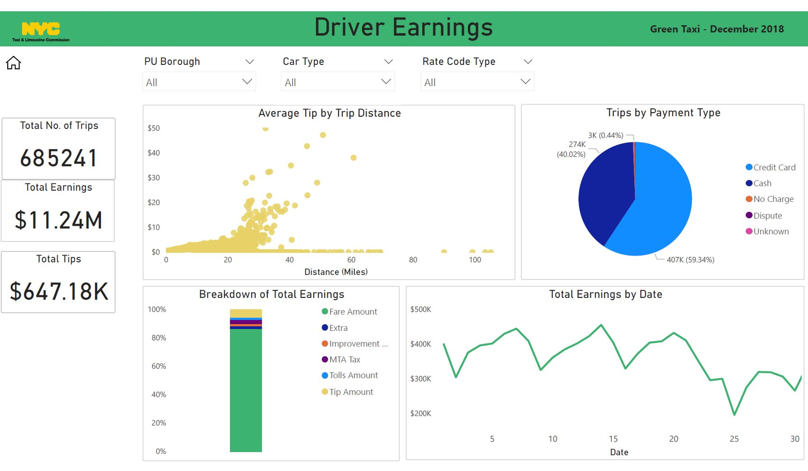
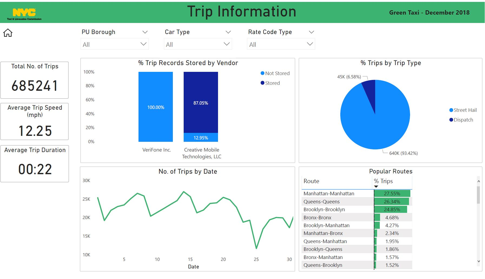

# Green-Taxi-Data-Visualization
PowerBI visualization on US Green Taxi Data to analyse the driver earnings and derive insights on the company's trip patterns. This README provides an overview of the PowerBI dashboard and the story presented in it.

## Dataset
The data is collected by the New York City Taxi and Limousine commission about "Green" Taxis. I have performed visual analysis on one month data (December 2018).

Data is available at https://www1.nyc.gov/site/tlc/about/tlc-trip-record-data.page

## Visual Analysis
I have performed the analysis on two different themes:
- Driver Earnings
- Trip Information

### Driver Earnings:
This section provides an overview of tips received by the drivers. It provides an insight on variation of trip earnings by various cuts and segments.

### Trip Information:
This section informs about the routes taken by the Taxi and insights on the popular routes taken by the taxi drivers in NYC.

